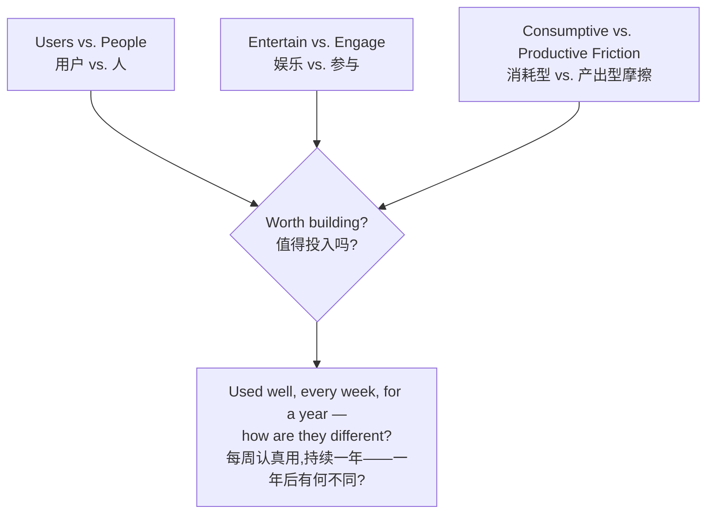

# Neo-Slow Media 新慢媒体

A tool for content infrastructure design — helping you build product brand and user experience through content.
一套内容基建设计工具——帮助你用内容的方式搭建产品品牌及用户体验。

By xiaojiahaina — senior media editor and design researcher, ongoing research and practice since 2021.
作者:xiaojiahaina — 资深媒体编辑、设计研究员,自 2021 年起持续研究与实践至今。

**Use it for 适合:**

- Early product/feature screening — "should we build this"
  早期产品/功能筛选——"该不该做"
- Honesty checks on content and marketing copy
  内容与营销文案的诚实度审查
- Catching "looks useful but is actually performing" self-deception
  识破"看起来有用,其实在表演"的自我欺骗

Neo-slow media grew out of the 2010s "slow media" movement — but it is not that movement's digital-detox pessimism. As AI-generated content, and AI involvement in making products, becomes a growing share of what gets made, it asks how to protect attention from *within* the digital, not by escaping it: a working method for media that rewards curiosity and critical, cross-disciplinary thinking.
新慢媒体从"慢媒体"演变而来——但不是数字排毒式的消极主义。在 AI 生成内容、AI 参与产品创作的比例持续上升的当下,它思考的是如何在数字之*内*保护注意力,而不是逃离数字:一套鼓励好奇心与跨领域思辨的媒介制作方法。

---

## The model 核心模型

**Users vs. People** — Platforms are designed for predictable, quantifiable *users*. The person on the other end is a *person*: superstitious, seeking recognition, unpredictable. A feature request is often a symptom of a deeper human need.
平台是为可预测、可量化的*用户*设计的。屏幕另一端是活生生的*人*:会迷信、渴望被看见、不可预测。一个功能需求,常常是更深层人类需要的症状。

**Entertain vs. Engage** — Entertainment produces pleasure that ends when the screen closes. Engagement rebuilds a person's relationship to something that matters, and the change persists after they leave.
娱乐产生的愉悦在关屏那一刻结束。参与重建的是一个人与其在意之事的关系,这份改变会在离开之后依然留存。

**Consumptive vs. Productive Friction** — Not all friction is the enemy. Consumptive friction drains without return; productive friction costs something and gives back more — skill, reflection, a genuine choice.
不是所有摩擦都是敌人。消耗型摩擦只索取不回报;产出型摩擦要求付出,但换回更多——能力、反思、真实的选择。

**The final question** — If someone engages with this well, every week, for a year: how are they different at the end of that year? "Saved some time" is useful, ship it. "Thinks or feels differently about something that matters" is worth the deeper investment.
最终之问——如果一个人认真用它,每周一次,持续一年:一年后他有何不同?"省了点时间"是有用的,做出来就好。"对某件在意的事想法或感受不同了"才值得更深的投入。

---

## Try it 试一试

Pick one thing you're building right now. Run it through the three lenses above. [Open an issue](../../issues) with what you found — the sharpest ones get folded into the field guide as new worked examples.
挑一件你正在做的东西,套一遍上面这三个视角。把你的发现[开一个 issue](../../issues)——最锋利的几个,会被收进 field guide 做成新的应用示例。

**Go deeper — the full field guide 完整版:**

- [English](FIELD-GUIDE.en.md)
- [中文](FIELD-GUIDE.zh.md)

**Use it with an AI agent 给 agent 用:**

- [Agent Skills](agent-skill/) — a suite of four narrow skills (full evaluation, editorial review, one friction question, the final question alone), built to the open agentskills.io spec; verified with Claude Code, should work the same way in other Agent Skills-compatible tools (Cursor, GitHub Copilot, Codex, Gemini CLI) though not individually tested
- [Agent Skills 技能套件](agent-skill/) — 四个各自独立、触发范围窄的 skill(完整评估、内容审阅、单点摩擦判断、单独的一年之问),遵循开放的 agentskills.io 标准;已在 Claude Code 验证,其他兼容 Agent Skills 的工具(Cursor、GitHub Copilot、Codex、Gemini CLI)理论上同样适用,但未逐一实测
